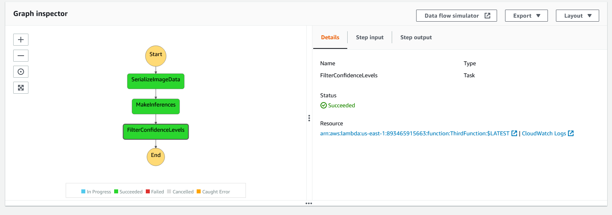

### Table of Contents

 1. [Installation](#installation)
 2. [Project Motivation](#motivation)
 3. [File Descriptions](#files)
 4. [Results](#results)
 5. [Licensing, Authors, and Acknowledgements](#licensing)

## Installation 

 The necessaries packages to run this project are:

 - jupyter notebook
 - numpy
 - matplotlib
 - pandas
 - numpy
 - sagemaker
 - boto3

 These packages can be installed via the terminal using "pip install <package name>"

 The code should run with no issues using Python versions 3.*.

## Project Motivation

 For this project, I was interested in using building a Amazon Web Service (AWS) Machine Learning Workflow that encompasses a image classification model to automatically detect the type of vehicle delivery drivers have : bicycle or motorcycles.

 The dataset was the CIFAR-100 dataset, provided by the Toronto University (https://www.cs.toronto.edu/~kriz/cifar.html).

 The deployed model should be scalable to meet demand and safe in order to avoid drift or degraded performance.

 The workflow used AWS Lambda Functions and Step Functions to guarantee automation, scalability and the desired performance safeguards.

## File Descriptions 

List of files:

 - starter.ipynb: Jupyter notebook used to create the workflow.
 - Lambda.py: Python script with the lambda functions used in the workflow.
 - step_function.json: JSON file of the step function linking the lambda functions.

 The starter notebook contains the code used to download and process the data, train and deploy the model as well as generate visualizations to help monitor the workflow performance. Markdown cells were used to assist the understanding of the code.

## Results

An example of the workflow of the Step Function during execution:
 

 The graphs plotted to check the inferences of the model can be seen at the final of the starter notebook.

## Licensing, Authors, Acknowledgements

 Must give credit to the Toronto University for the data. Feel free to use the code here as you would like! 
